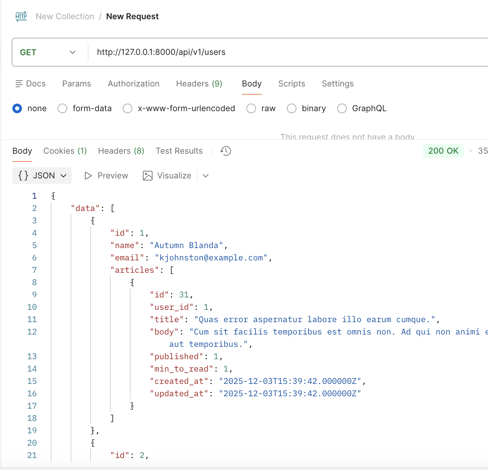

# My Laravel RESTful API

RESTful API built with Laravel 12, using Sanctum for authentication.  
Supports **users** and **articles** resources with authorization, policies, pagination, and structured error handling.

---

## 🛠️ Features

- **Authentication**: Token-based using **Laravel Sanctum**
- **Users**: 
  - List users (only public info + their published articles)
  - View user details
- **Articles**:
  - CRUD operations (Create, Read, Update, Delete)
  - Users can only view/edit/delete their own articles
  - Users can see all their articles, whether published or not
- **Authorization**:
  - Policies enforce resource ownership
  - Only authorized users can perform actions
- **Pagination**:
  - API endpoints support pagination (`?page=2`)
- **Error Handling**:
  - Structured JSON responses for validation errors, authorization, and general exceptions
- **API Versioning**: `/api/v1/`

---

## 🔑 Authentication

Use **Sanctum** to authenticate and obtain a token.

**Login:**
```

POST /api/v1/auth/login
Content-Type: application/json

```

Response:
```json
{
  "token": "YOUR_ACCESS_TOKEN"
}
````

Include the token in the `Authorization` header for protected routes:

```
Authorization: Bearer YOUR_ACCESS_TOKEN
```

---

## 📦 Endpoints

### Users

| Method | Endpoint           | Description                         |
| ------ | ------------------ | ----------------------------------- |
| GET    | /api/v1/users      | List all users + published articles |
| GET    | /api/v1/users/{id} | View a single user                  |

### Articles

| Method | Endpoint              | Description                                   |
| ------ | --------------------- | --------------------------------------------- |
| GET    | /api/v1/articles      | List all published articles                   |
| GET    | /api/v1/articles/{id} | View a single article (authorization applied) |
| POST   | /api/v1/articles      | Create a new article (authenticated)          |
| PUT    | /api/v1/articles/{id} | Update an article (only own articles)         |
| DELETE | /api/v1/articles/{id} | Delete an article (only own articles)         |

---

## ⚡ Pagination

All listing endpoints support pagination:

```
GET /api/v1/articles?page=2
```

Response includes pagination metadata:

```json
{
  "data": [...],
  "links": {...},
  "meta": {...}
}
```

---

## 🚨 Error Handling

All errors return JSON with proper HTTP status codes:

* **403 Forbidden**: Unauthorized access
* **404 Not Found**: Resource not found
* **422 Unprocessable Entity**: Validation errors
* **500 Internal Server Error**: Unexpected errors

Example response:

```json
{
  "success": false,
  "message": "You are not authorized to delete this article"
}
```

---

## 📸 Screenshots

<!-- Add your screenshots here -->

```



```

---

## ✅ Notes

* Ensure users **cannot modify resources they do not own**
* Policies are implemented to enforce business rules
* API responses are formatted consistently using **Laravel API Resources**
* Supports future **versioning** and **role-based access control** if needed

---

## ⚙️ Installation

1. Clone the repository:

```bash
git clone https://github.com/your-repo.git
```

2. Install dependencies:

```bash
composer install
```

3. Set up `.env` file and database

4. Run migrations:

```bash
php artisan migrate
```

5. Serve the application:

```bash
php artisan serve
```

